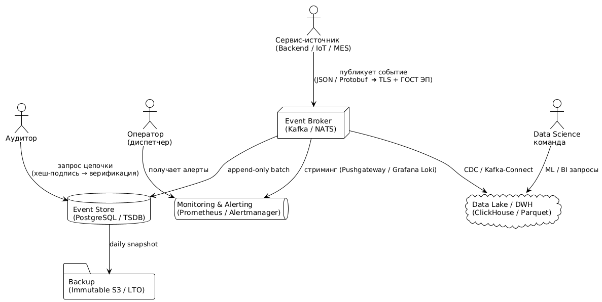

# Поток событий

**Поток событий** — неизменяемая, append-only хронология всех ключевых действий и состояний системы.
Записи вносятся только добавлением, хранятся с резервированием; «исправить» событие можно лишь
создав **новое** событие-коррекцию, которое остаётся в общей ленте.

#### Зачем нужен поток

1. **Онлайн-наблюдение и алертинг** → события в реальном времени уходят в Prometheus / Grafana, Loki, ELK.  
2. **Аудит и форензика** → полная цепочка подписанных (hash + ЭП) сообщений без «белых пятен».  
3. **Историческая аналитика и ML-прогнозы** → реплика в DWH / Data Lake (Parquet, ClickHouse, BigQuery) для отчётности, SLA-анализа и моделирования отказов.

> **Единая точка правды.** Данные подписаны сервисами-источниками и дублируются, спор о достоверности исключён.

---

## Схема взаимодействий

### 1. Компонентная диаграмма (PlantUML)

Подпись и хеш хранятся в событии (`sig`), проверяются на чтении; резервныекопии партиций Event Store уходят в неизменяемое хранилище (S3 Object Lock или LTO).

### Краткое описание
| Маршрут                  | Назначение                        | Гарантии                    |
| ------------------------ | --------------------------------- | --------------------------- |
| **Services → Broker**    | Публикация событий в 1 транзакцию | TLS 1.3 + ГОСТ ЭЦП          |
| **Broker → Event Store** | Batch-запись; партиции по дню     | Append-only, WAL-replica    |
| **Broker → Monitoring**  | 1-2 сек задержка                  | SLA 95-й percentile ≤ 5 сек |
| **Store → Backup**       | Immut-S3 / лента LTO-9            | RPO ≤ 15 мин                |
| **Broker → DWH**         | CDC / Kafka-Connect               | Δ < 5 мин для BI            |

